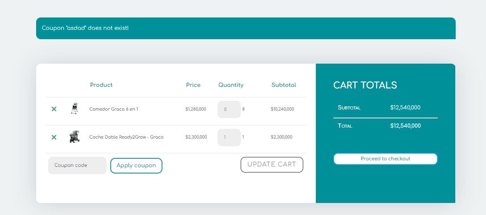

# Pages MomHome&Baby 👶.

--- 
<br/>

## 	🏡 Home page

<br/>
 
###	✔️ Header

- **menu** 
  - categorias *(poder filtar desde aqui la catagoria que quiera)*
  - ofertas *(ir a una pagina con todas las ofertas)*
  - filtro por marca
  - ir a tienda 
- **logo** 
- **searchbar**
- **login / logut**
- **filtros de categorias**
- **[cart](#🚗-carrito-de-compras)**

###	✔️ Footer
- **Icons** *(para las redes sociales, _WA, fb e instagram_)*
- **Nosotros** *(redirige a la pagina nosotros)*
- **politica de privacidad** *(redirige a la pagina politica de privacidad)*
- **Derechos reservados** <br/>
```code: <span>{new Date().getFullYear()} &copy; All Rights Reserved.</span>```

###	✔️ Homepage
- **Hero Image**
  - logo 
  - imagen 
  - quote *(Asesoramos a mamitas primerizas en la elección de los mejores productos para su embarazo, lactancia y sus bebés. ¡Ahorrándoles horas de investigación!)*
  - boton para ir a tienda
- **Nuevos produtos** *(muestra 4 productos __los agregados recientemente__)*
  - 🔲 [card](#💁-card-info)  
- **Baner** *(banner que mostrara 2 mensajes ingresados por el admin user)*
- **Imperdibles** *(Muestra 4 pruducts __los que esten en oferta__ )*
  - 🔲 [card](#💁-card-info)  
- **Nuestros recomendados** *(Muestra 4 productos __Los de mayor rating__)*
  - 🔲 [card](#💁-card-info)  

<br/> 

---
<br/> 

## 	📝 Details 

### ✔️ **[Header](#✔️-header)**

### ✔️ Detail Section 
- **Details Section**
  - [card](#💁-card-info) *(la informacion contenida no el diseño)*
  - detalles
  - categorias *(solo a las que pertenece, posiblidad de filtar cuando se da click)* 
  - numero items *(posibilidad de agregar mas de 1 item)*
- **Releted products** *(mostrar 3 items de las misma categoria los de mejor rating)*
- **[Filtros](#💁-filtros)**
- **Review Section**
- **Rating**
  - Enviar Review *(comentarios hacerca del producto que seran enviados por el cliente)* **[Inf](#⚠️-login)** ⚠️
    - nombre del cliente  
    - usuario que envio el comentario
    - calificacion o rating 
    - Fecha
- **Review anteriores** *(en esta seccion se podra ver todas las review de este producto)*

### ✔️ **[Footer](#✔️-footer)**

<br/> 

---
<br/> 

## 💳 Tienda

### ✔️ **[Header](#✔️-header)**
### ✔️ Store section
- **Hero Image**
- **Products section** *(se debe mostar 9 cartas por cada pagina)*
  - paginacion
  - [Filtros](#💁-filtros)
  - 9 [cards](#💁-card-info)
- **highlight products**
  - 4 [cards](#💁-card-info) *(los mas vendidas)*
- **filtro de categorias** 
### ✔️ **[Footer](#✔️-footer)**
<br/> 

---
<br/> 

## 📜 Categorias 

### ✔️ **[Header](#✔️-header)**

### ✔️ Categories section
- **Header secundario** *(para mostrar en que categoria esta)*
  - > Estas viendo la categoria: {nombre de la categoria}

- **Products section** *(se debe mostar 9 cartas por cada pagina)*
  - paginacion
  - [Filtros](#💁-filtros)
  - 9 [cards](#💁-card-info)
- **highlight products**
  - 4 [cards](#💁-card-info) *(los mas vendidas)*
- **filtro de categorias** 
### ✔️ **[Footer](#✔️-footer)**
<br/> 

---
<br/> 


## 	🚗 Carrito de compras 

*(esta seccion debe tener solo informacion acerca de la compra)*

### ✔️ **[Header](#✔️-header)**
### ✔️ seccion de verificacion de la compra
- **Titulo** *(mi carrito)*      
- **Detalle de la compra** 
  - una tabla con los campos   
    - product *(contendra una imagen  y el nombre)* 
      - ❌ posibilidad de elimiarlo 
      - nombre
    - precio
    - cantidad
    - subtotal
  - Cart Total 
    - Subtotal 
    - total 
    - boton proceder a checkout
    - 💡 [Idea](#📷-idea-cart)

### ✔️ seccion de proceder al pago ⚠️ **[Inf](#⚠️-login)** 
- **Titulo** *(Finalizar compra)*     
- **Detalles de facturacion**
- **Informacion adicional**
- **Tu orden** 
  - una tabla con la informacion     
    - producto 
    - subtotal
    - total
- **place order button**
### ✔️ seccion de confirmacion ⚠️ **[Inf](#⚠️-login)**
- **Confirmacion**
- **Detalles de la compra**
### ✔️ **[Footer](#✔️-footer)**
<br/> 

---
<br/> 

## 	⤴️ Rutas _(Front)_

- 🏡 **[HomePage](#🏡-home-page)**:  _/_
- 📝 **[details](#📝-details)**: _/productos:id_
- 💳 **[tienda](#💳-tienda)**: _/tienda_
- 📜 **[categorias](#📜-categorias)**: _/categorias/{nombre de la categoria}_
- 🚗 **[carrito](#🚗-carrito-de-compras)**: _/cart_
- ✔️ **[Finalizar compra](#✔️-seccion-de-proceder-al-pago-⚠️-inf)**: _/Finalizar-compra_

<br/> 

---
<br/> 


# ❓ informacion adicional 

#### 💁 Card info 
- imagen 
- categorias
- titulo 
- precio 
- si esta o no en oferta 
- starts y reviews 
- agregar a carrito 
- favoritos 
- stock _(cuantos disponibles)_

#### 💁 Filtros 
*(Se mostraran tienda)*
- Precio mayor y menor 
- Por rango de precio
- del mas vendido al menos vendido y viceversa
- Por categoria 
- marca o modelo

<br/>

---
<br/>

# 🔐 Admin page

### 📖 Pages

### ✔️ Dashboard 

- **Orders**
  - today
    - number of orders _(2 orders today)_
  - this week 
    - number of orders _(2 orders this week)_
  - this month <br/>
    - number of orders _(2 orders this mont)_

- **Revenue**
  - today 
    - Total
    - Number of orders _(2 orders today)_
  - this week 
    - Total
    - Number of orders _(2 orders this week)_
  - this month <br/>
    - Total
    - Number of orders _(2 orders this mont)_
- 💡 [Idea](#idea-dashboard)

### ✔️  Produts

- **Add NEW Product**
- **Product name**
  - product name (Form)
    - product name 
    - [edit](#✏️-edit) button
    - delete button

### ✔️  Categories

- **Create new category**
  - parent category _(posivilidad de escojer una categoria padre)_

- **Property**
  - button add [Properties](#📝-porperties)

- **Save Button**

### ✔️  Orders
- **Table**  
  - Date
  - paid 
  - Recipient (Destinatario)
    - nombre
    - email
    - direccion 
    - telefono
  - produtos lista   
### ✔️  Admins
- **add new Admin**
  - Google email 
  - button add admin
### ✔️  Existing admins    
- **add new Admin**
- **admin google email**
  - email 
  - desde 
  - eliminar  
### ✔️  Settings
- **Featured product** 
- **Shipping price**   
- **save button**
 
### ✔️ Logout
- **button** 

---
### ✏️ edit
- **Product name** (text)
- **Category** 
- **Color** 
- **Storage**
- **Photos**
- **description**
- **Price**
- **saveButton**
### 📝 porperties
- **Edit category Mobiles**
  - tipo de categoria
  - catagoria padre
- **Porperties**
  - button add new porpoerty
  - cancel button 
  - save button


<br/>

---
<br/>

# 💻 GitHub comandos


### ✏️ Para inicar el repositorio
🔘 Verificar las ramas remotas que estan creadas 
> git fetch --all 

🔘 cambiar de a la rama de dev 
> git switch dev 

🔘 Creamos la rama en la que vamos a trabajar _(recoredar crearla desde **dev**)_
> git checkout -b {nombre de la rama}

❌[Errores](#❌-errores-comunes) 

---

### 💲 Trabajando 

🔘 verficar que cambios estan pendientes y en que carpeta ocurrieron 
> git status

🔘 cometi un error pero **ya tengo un commit** anterior que estaba funcionado _(esto solo nos regresa a el commit anterior si ya hice commit **no va a funcionar**! )_
> git checkout -- . 

🔘 verificar que ramas tengo en **mi** repositorio local 
> git branch

🔘 verificar que ramas hay en **el** repositorio virtual
> git branch -a

🔘 necesito traer una rama que no esta en mi repo local _(**git-fetch** - Descarga objetos y referencias de otro repositorio )_
> git fetch --all <br/>
> git switch {nombre de la rama}

### ⬆️  Subiendo mis cambios (Pull Request)
🔘 verificar que este actulizado donde esto trabajando 
> git fetch --all <br/>
> git status  <br/>
> git add . <br/> 

❗❗ vericar que estoy subiendo los archivos correctos
> git status  <br/> 
> git commit -m mensaje claro <br/>
_con el que pueda entender en que parte voy por si me quiero regresar_ <br/>
> git push origin _{nombre de la rama}_

🔘 ir a github 
- selecciona la rama en la que se estuvo trabajando 
- contribute
- open pull request  
- agrege un titulo con el nombre de la carpeta y componente que cambio
- explique con detalle lo que cambio 

# ❗❗❗❗ en la parte superior seleccione Dev ❗❗❗❗❗❗


🔘 Eliminado Branch _(esto se hara unicamente cuando ya tengamos la seguridad de questa rama y la informacion en ella no la vamos a usar mas)_
> git branch -d nombre-de-rama

### ❌ Errores comunes 
No me puedo cambiar de rama: (_Verifca que los cambios los estes subiendo_) 
> git status

No puedo salir de la terminal: 
> (_oprime: **q**_)


```bash
# subimos los cambios
git commit -m "mensaje"  
# ir al ultimo commit guardado 
git checkout -- .

# para sobre escribir un commmit 
git reset --mixed idDelCommit

# para ver el log general/ historico 
git reflog

# para subir la rama
git push origin nombredelarama

# sincroniza el log general con el log de reflog
git fetch 

# Eliminar rama en remoto 
git push origin :{nombre de la rama}

# agrega y commitea al mismo tiempo 
git commit -am "mensaje"

# para ver actualmente a que repositorio le esta apuntando
git remote -v 

# ver todas las ramas que estan disponibles
git branch

# muestra todas las ramas locales y remotas 
git branch -a

# me llava al ultimo commit de la rama seleccionada 
git checkout remotes/origin/{nombre de las ramas}
# para moverse entre ramas
git switch {nombre de la rama}

#If you wish to set tracking information for this branch you can do so with:
git push --set-upstream origin nombre de la rama 

# mostar inf de donde estas 
git remote show origin to check this.

```

### 📊 Back 

#### 🔌 **Conexion del back y la base de datos**
- ↪️ **Rutas del back** _(post, get, put, delete)_
  - **Get** _(obetener toda la informacion y porductos)_
    - _obtener categorias_
    - _obtener por id_
      -  _obtener el inventario por producto_
    - _obtener por name_
  - **Post**  _del admin cuando agrega productos nuevos_  
    - _agregar imagenes_
    - _agregar titulo_
    - _descripcion_
    - _precio_
    - _stock_
    - _categorias_
    - _esta en oferta_
  - **Post** _Cuando se sube una reseña_
    - _rating_
    - _comentarios_
  - **Post** _usuario_
    - _fav_(*id*) 
  - **Post** _del carrito por cada usuario_
    - _lista de productos (**Ids**)_
  - **Put** _cuando se paga_
    - _actuliza stock_
    - _se envia confirmacion_***
  - **Put** _Admin_
    - _Actuliza stock_
    - _Precio_
    - _Si esta en oferta_
    - _Descripcion_
    - _Nombre_
    - _Actuliza nombre de la catagoria_
    - _Imagen_
  - **Delete** _Admin_
    - _Productos_
  - **Delete** _Usuarios_
    - _cuenta_

### 🏧 Base de datos 
- Informacion que debe estar 
  - Categorias 
  - usuarios 
    - es admin? 


### 📍 Recursos adicionales instalados 

[Font Awesome](https://fontawesome.com/search) 
_(Ingresa y podras buscar cualquier icon *free* solo debes copiar y pegar. **Html es el tipo** )_

[Framer motion](https://www.youtube.com/watch?v=_YapA2FdZwc)
_(hace mucho mas facil las animaciones)_

#### ⚠️ Login 
❗ ❗ **(_para usar esto debe estar logeado_)** ❗ ❗ 
### 📷 Idea Cart

### Idea Dashboard

